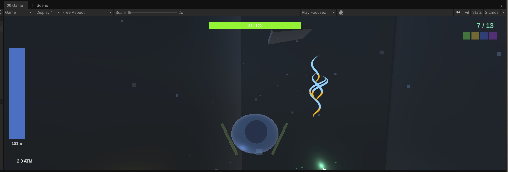

# Deep Canyon Currents VFX Implementation Plan

> **For agentic workers:** REQUIRED SUB-SKILL: Use superpowers:subagent-driven-development (recommended) or superpowers:executing-plans to implement this plan task-by-task. Steps use checkbox (`- [ ]`) syntax for tracking.

**Goal:** Add real zone-based VFX Graph currents that visually match the existing current physics and make current corridors readable in the Deep Canyon level.

**Architecture:** Keep `CurrentField` and `CurrentForceApplier` as the gameplay foundation, expand `CurrentZone` with visual profile data, introduce a focused binder for `VisualEffect` parameters, and wire a shared `.vfx` asset into all current zones created by the scene setup script.

**Tech Stack:** Unity 6, URP, Visual Effect Graph, Unity Test Framework EditMode tests, Unity MCP.

---

### Task 1: Define testable current-visual parameters

**Files:**
- Modify: `Assets/DeepCanyon/Scripts/Currents/CurrentZone.cs`
- Test: `Assets/DeepCanyon/Tests/EditMode/CurrentZoneVisualsEditModeTests.cs`

- [ ] **Step 1: Write the failing test**

```csharp
[Test]
public void CurrentZone_DepthFactor_GrowsWithDepth()
{
    var zone = BuildZone(new Vector3(0f, -200f, 0f), Vector3.right, 12f);
    Assert.That(zone.GetDepthFactor(), Is.GreaterThan(0.75f));
}

[Test]
public void CurrentZone_VisualDirection_MatchesZoneDirection()
{
    var zone = BuildZone(Vector3.zero, new Vector3(1f, 0f, 0.5f), 8f);
    Assert.That(zone.GetVisualDirection(), Is.EqualTo(new Vector3(1f, 0f, 0.5f).normalized).Using(Vector3ComparerWithEqualsOperator.Instance));
}
```

- [ ] **Step 2: Run test to verify it fails**

Run: `Unity EditMode tests for CurrentZoneVisualsEditModeTests`
Expected: FAIL because `GetDepthFactor()` and `GetVisualDirection()` do not exist yet.

- [ ] **Step 3: Write minimal implementation**

Add focused public helpers on `CurrentZone`:
- `GetVisualDirection()`
- `GetDepthFactor()`
- `GetWorldCenter()`
- `GetWorldSize()`
- `GetVisualStrength()`

- [ ] **Step 4: Run test to verify it passes**

Run: `Unity EditMode tests for CurrentZoneVisualsEditModeTests`
Expected: PASS

### Task 2: Add a dedicated VisualEffect binder

**Files:**
- Create: `Assets/DeepCanyon/Scripts/Currents/CurrentZoneVFXBinder.cs`
- Test: `Assets/DeepCanyon/Tests/EditMode/CurrentZoneVisualsEditModeTests.cs`

- [ ] **Step 1: Write the failing test**

```csharp
[Test]
public void Binder_MapsZoneData_ToRuntimeProfile()
{
    var zone = BuildZone(new Vector3(0f, -180f, 0f), Vector3.forward, 14f);
    var profile = CurrentZoneVFXBinder.BuildProfile(zone);

    Assert.That(profile.FlowDirection, Is.EqualTo(Vector3.forward));
    Assert.That(profile.FlowStrength, Is.GreaterThan(0f));
    Assert.That(profile.DepthFactor, Is.GreaterThan(0.7f));
}
```

- [ ] **Step 2: Run test to verify it fails**

Run: `Unity EditMode tests for CurrentZoneVisualsEditModeTests`
Expected: FAIL because `CurrentZoneVFXBinder` and `BuildProfile()` do not exist.

- [ ] **Step 3: Write minimal implementation**

Create a binder that:
- requires `CurrentZone` and `VisualEffect`
- builds a small runtime profile from zone data
- pushes `FlowDirection`, `FlowStrength`, `ZoneCenter`, `ZoneSize`, `DepthFactor`, `Turbulence`

- [ ] **Step 4: Run test to verify it passes**

Run: `Unity EditMode tests for CurrentZoneVisualsEditModeTests`
Expected: PASS

### Task 3: Introduce the shared VFX Graph asset

**Files:**
- Create: `Assets/DeepCanyon/VFX/Currents/UnderwaterCurrentZone.vfx`
- Create: `Assets/DeepCanyon/VFX/Currents/UnderwaterCurrentZone.vfx.meta` (if needed via Unity asset creation flow)

- [ ] **Step 1: Create the VFX asset from a stable template**

Use a built-in VFX Graph template as the starting point rather than hand-authoring raw graph structure from scratch.

- [ ] **Step 2: Ensure the graph exposes required properties**

The graph must expose:
- `FlowDirection`
- `FlowStrength`
- `ZoneCenter`
- `ZoneSize`
- `DepthFactor`
- `Turbulence`

- [ ] **Step 3: Shape the graph for current corridors**

Minimal visual language:
- ribbon or strip streaks for direction
- soft fill particles for volume
- small floating particles for suspended matter

- [ ] **Step 4: Verify the asset imports cleanly**

Run: Unity compilation/import check
Expected: no errors in console

### Task 4: Replace current zone particle placeholders in scene setup

**Files:**
- Modify: `Assets/DeepCanyon/Scripts/Editor/DeepCanyonSceneSetup.cs`

- [ ] **Step 1: Write the failing test**

Use a small edit-mode scene build validation:

```csharp
[Test]
public void BuildScene_CurrentZone_HasVisualEffectBinder()
{
    DeepCanyonSceneSetup.BuildScene();
    var zone = GameObject.Find("Current_Z2");
    Assert.That(zone.GetComponentInChildren<CurrentZoneVFXBinder>(), Is.Not.Null);
}
```

- [ ] **Step 2: Run test to verify it fails**

Run: `Unity EditMode tests for current scene build`
Expected: FAIL because zones still create `ParticleSystem` placeholders.

- [ ] **Step 3: Write minimal implementation**

Update `MakeZone()` so each zone:
- creates a child `VisualEffect` object
- assigns `UnderwaterCurrentZone.vfx`
- adds `CurrentZoneVFXBinder`
- no longer relies on the old placeholder current particles

- [ ] **Step 4: Run test to verify it passes**

Run: `Unity EditMode tests for current scene build`
Expected: PASS

### Task 5: Verify in Unity runtime

**Files:**
- Modify if needed: `Assets/DeepCanyon/Scripts/Currents/CurrentZoneVFXBinder.cs`
- Modify if needed: `Assets/DeepCanyon/Scripts/Editor/DeepCanyonSceneSetup.cs`

- [ ] **Step 1: Rebuild scene and enter Play Mode**

- [ ] **Step 2: Capture screenshots of at least three zones**

Check:
- direction readability
- different look for corridor, cross-current, jet
- no pink materials or missing graph references

- [ ] **Step 3: Verify physics and VFX match**

Teleport player into zones and confirm:
- VFX points in the same direction as applied force
- stronger zones look denser or brighter
- deeper zones feel visually heavier

- [ ] **Step 4: Run the focused test suite again**

Run: `Unity EditMode tests for CurrentZoneVisualsEditModeTests and scene build checks`
Expected: PASS
